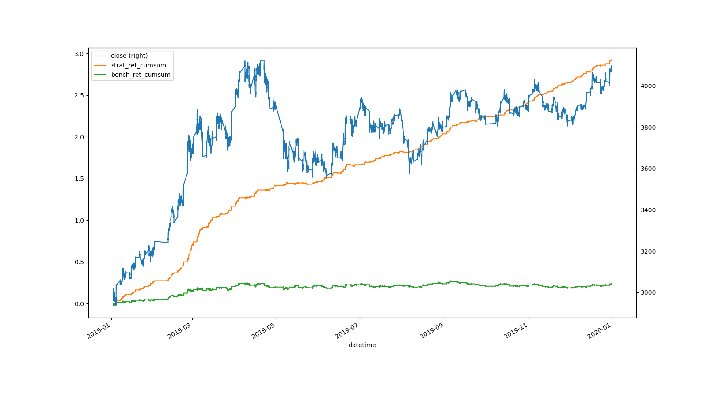
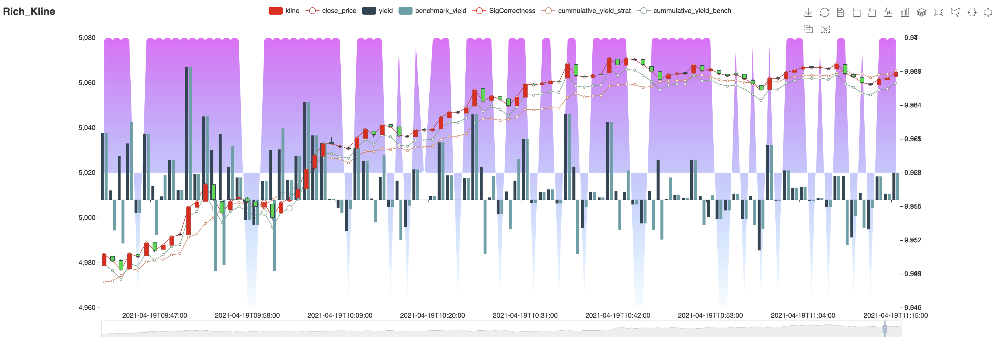
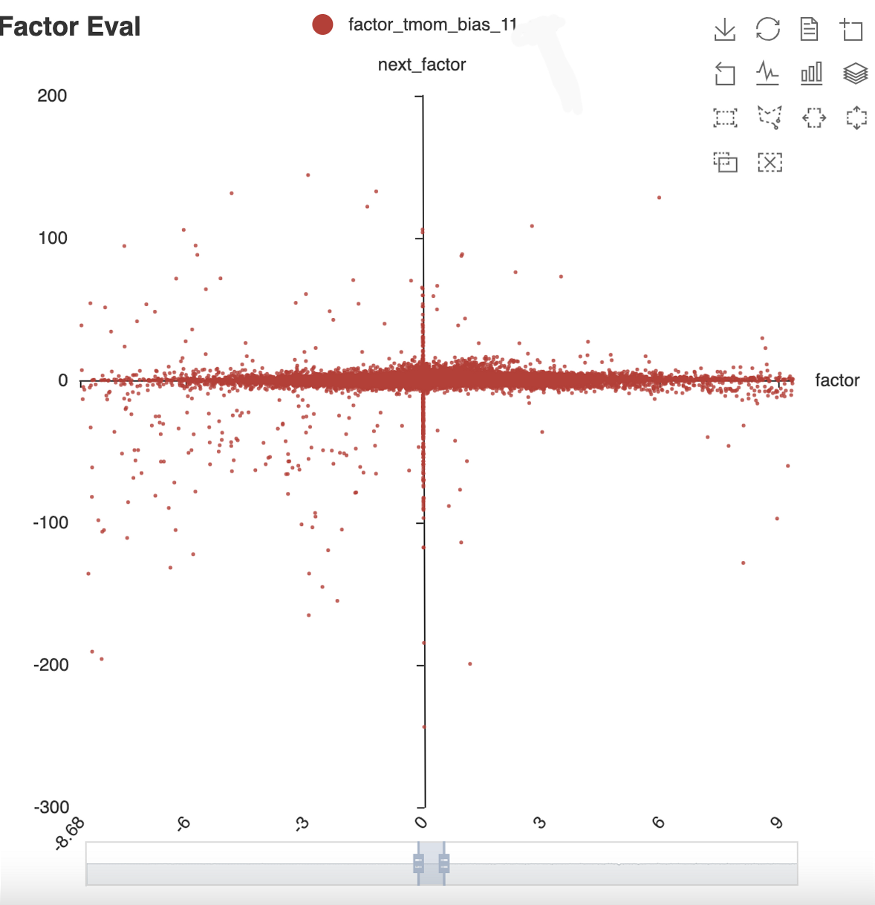

One time series analysis tool
===============

Organization
--------------------
    .
    ├── LICENSE
    ├── README.md
    ├── data
    │   └── futures
    │       └── raw
    │           └── intraday_data
    │               └── index300_main_430-510.parquet
    ├── docs
    │   ├── backtest
    │   └── log.txt
    ├── requirements.txt
    └── src
        ├── __init__.py
        ├── backtest
        │   ├── __init__.py
        │   └── backtest.py
        ├── factor
        │   ├── __init__.py
        │   └── factor.py
        ├── main.py
        └── visualization
            ├── __init__.py
            └── rich_visual.py

--------

##Install

    python3 -m pip install -r requirements.txt

##Guide 

使用本回测框架很简单：
1. 在factor.py中编写需要测试的因子（注意返回格式统一）
2. 在main.py中配置测试用的数据参数，and run that shit.

回测结果会分为两部分呈现：
1. 在运行窗口会以logger的形式呈现部分回测信息，
2. 在docs/backtest文件夹下会生成每一次测试的记录文件，包括：
   
   2.1 累计收益率走势图， 处理过后的行情数据，回测的详细信息记录；
   
   2.2 如果回测结果满足一定的条件，则生成一个基于pyecharts的可视化页面。

* 我本地用的是Clickhouse，为了简单方便，数据库部分可以按需求自行搭建，factor.py和backtest.py中的数据来源改成了data中的文件

----

## Result Description

每一次回测之后都会生成一份关于回测结果的描述性文档，如下所示：

      Strategy: [<bound method FactorX.factor_tmom_bias_11 of <src.features.factors.factor_tmom.FactorX object>>] 
      Transaction Fee Percentage: 0.0
      Intraday Closing Time: [datetime.time(15, 0)]
      Params: [{'w': 7}, {'w': 15}]
      Test Period: 2019-01-01 00:00:00 - 2019-12-31 00:00:00
      -- ['symbol', 'IF'] --
      -- T1 -- 
      -- Position: 1 --
      -- Barly Stoploss: 100 --
      -- Action on Sig0: close --
      -- Signal Shift: [1] --
      Transaction Fee Total: 0.0%
      Signal Ratio: 64.53%
      Open Position: 15886 times; Close Position: 15886 times
      Sharpe Ratio: 14.88 
      Tail Ratio: 8.69
      Alpha: 1676.47% | Beta: 49.8% 
      Max Drawdown: -2.21% 
      Max Daily Drawdown: -1.01% 
      Total Win: 21711 | Total Loss: 15087 | W/L Ratio: 1.44
      Strategy Return: 290.22% | Strategy Annualized Return: 321.33%. 
      BenchMark return: 24.17% | BenchMark Annualized Return: 26.67%.
      
      
      Total Bars: 58804 
      
      Statistics Desc: 
      |       |         jackpot |           wrong |   missed |
      |:------|----------------:|----------------:|---------:|
      | count | 22124           | 15087           |    20667 |
      | mean  |     0.000346019 |    -0.00031372  |        0 |
      | std   |     0.000393854 |     0.000384317 |        0 |
      | min   |     0           |    -0.00981     |        0 |
      | 25%   |     0.0001      |    -0.00039     |        0 |
      | 50%   |     0.00022     |    -0.00019     |        0 |
      | 75%   |     0.00044     |    -8e-05       |        0 |
      | max   |     0.00703     |    -1e-05       |        0 |
      * NOTE: THIS DESCRIPTION DIFFERS FROM W/L RATIO ABOVE BECAUSE ONLY SIGNAL DIRECTION CORRECTNESS IS CONSIDERED HERE.
      
      
      Bias_factors: 
         # 这里记录的是方向性的因子
          def factor_tmom_bias_11_(self, w):
              # 因子源码也会记录下来，这样即使后续修改了因子，也可以方便查找历史记录。
      
      Neut_factors: 
         # 这里记录的是中性因子

----

## Visualization

目前的可视化仅包含以下几个类别，所以后续在可视化方面还可以继续填充新功能、新需求。

1. 简单的收益曲线图

2. K线 + 收益曲线 + 信号正确性 复合图

   

3. 因子-收益相关性散点图

   

4. 因子自相关性散点图

----

## 关于速度
目前仅backtest模块速度大致在 1000k bars/ s，但pyecharts绘图耗时比较严重，所以目前仅对较好的回测结果进行pyecharts的可视化。

----

## Todos

后续想要做的一些事情：
1. 完善这一套回测框架的逻辑验证工作，确保逻辑层面和最终结果的准确性。
2. 充填、扩展回测结果统计分析的内容，以及扩展可视化内容。
3. 将目前的单品种、多因子改造为多品种、多因子框架。
4. python有些地方会遇到精度问题，目前这部分我还没有很好的解决方案，Decimal太慢。目前用pandas和numpy强制检查及转换类型可以部分规避这类风险。

#### Updates

* 210519 

更新了ClickHouse读数据支持， 以及部分初始化检查、建表操作。
  
更新了回测框架使用数据来源部分，方便直接feed dataframe或匹配数据库操作。
  
更新了requirements.txt文件。

----

#### 联系作者：
   微信：muzexlxl

   email: muzexlxl@foxmail.com